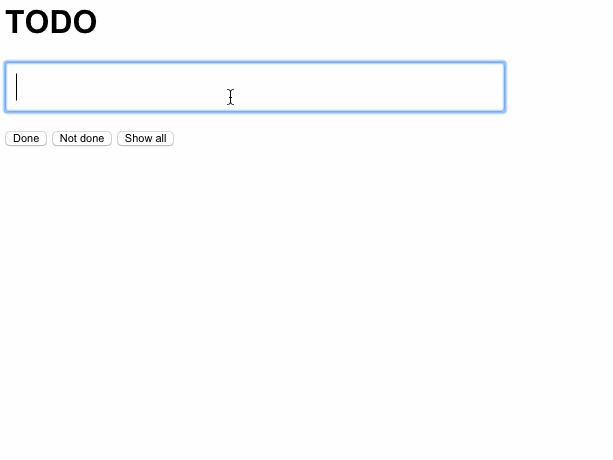

# TODO List

You can either keep using the files you created in exercise-1, or use the ones provided here as a base.

## Exercise 2

Building on your TODO list, add the following:

1. When creating a new TODO item, assign it a unique id
2. When a box is checked, make the corresponding TODO item crossed out. When it is unchecked, make it not crossed out.
3. When the TODO item is checked, log to the console the id of the item that was checked

BONUS:

1. Make buttons that, when clicked, filter all done items and not done items
2. Make a button for each of your todo items for completely deleting that item

BONUS BONUS:

1. Use CSS to make the list look better and the buttons aligned

